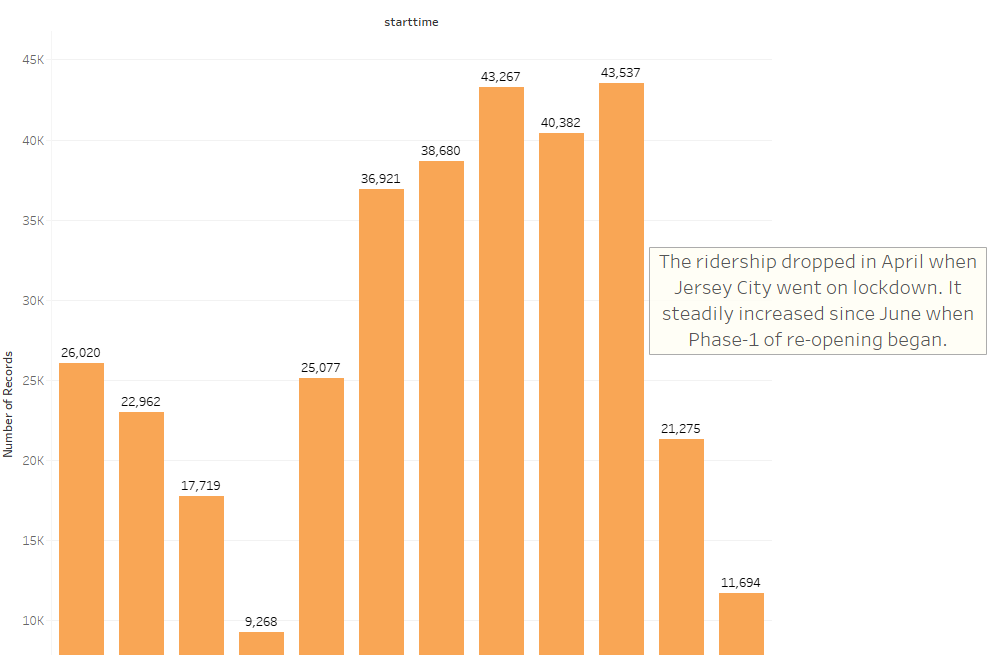
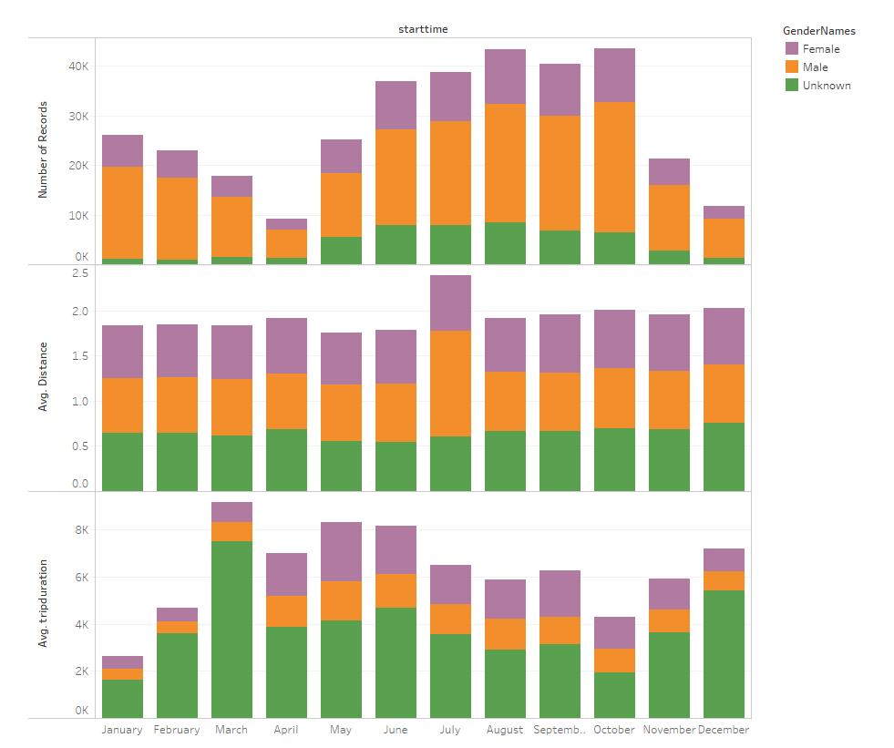

# Jersey City Citi Bike Data Analysis for the year 2020

### Peak Hours

The peak hour for trip start and trip end is 6pm. This is different than the results from earlier years where 8am was also a high traffic time. The lockdown due to COVID pandemic is the reason for the change seen in year 2020.
***

### Trips recorded for each month

The ridership dropped in April when Jersey City went on lockdown. It steadily increased since June when Phase-1 of re-opening began.
***

### Popular Stations

Grove St PATH in downtown Jersey City is the most popular bike station for trip start, trip end, and among subscribers who have annual Citi Bike pass. But, among 24-hour pass or 3-day pass users, Liberty Light Rail bike station is the most popular one. This makes sense because Liberty Light Rail bike station is adjacent to the gorgeous Liberty State Park. So, most of the riders here are tourists or local visitors who would use 24-hour or 3-day pass. Where as Grove St PATH bike station is adjacent to mass public transportion. So, riders here are daily commuters who would have annual pass for Citi Bike.
***

### Trip Ananlysis by Age

The average distance travelled is highest for the age group 22-25years. It decreases as age moves past 65 years. This is self explanatory. The trip duration remains fairly constant except for few longer duration trips that do not corelate to the trip distance. These may be instances where there was a delay in returning the bike to the station after the trip ended. The number of trips recorded is the highest for riders who are around 52 years old.
***

### Trip Ananlysis by Gender

The number of trips recorded is highest for male riders. In terms of distance travelled, both male and female riders have equal representation on the graph. Some users chose not to specify their gender, and they form the majority of riders having higher average trip duration.
